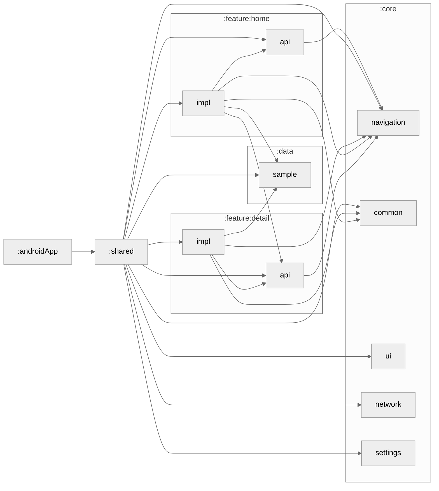

## Module Graph

```mermaid
%%{
  init: {
    'theme': 'neutral'
  }
}%%

graph LR
  subgraph :core
    :core:navigation["navigation"]
    :core:common["common"]
    :core:ui["ui"]
    :core:network["network"]
    :core:settings["settings"]
  end
  subgraph :data
    :data:sample["sample"]
  end
  subgraph :feature:detail
    :feature:detail:api["api"]
    :feature:detail:impl["impl"]
  end
  subgraph :feature:home
    :feature:home:api["api"]
    :feature:home:impl["impl"]
  end
  :feature:home:api --> :core:navigation
  :shared --> :core:common
  :shared --> :core:ui
  :shared --> :core:navigation
  :shared --> :core:network
  :shared --> :core:settings
  :shared --> :data:sample
  :shared --> :feature:home:api
  :shared --> :feature:home:impl
  :shared --> :feature:detail:api
  :shared --> :feature:detail:impl
  :androidApp --> :shared
  :feature:detail:impl --> :core:common
  :feature:detail:impl --> :core:navigation
  :feature:detail:impl --> :data:sample
  :feature:detail:impl --> :feature:detail:api
  :feature:home:impl --> :core:common
  :feature:home:impl --> :core:navigation
  :feature:home:impl --> :data:sample
  :feature:home:impl --> :feature:home:api
  :feature:home:impl --> :feature:detail:api
  :feature:detail:api --> :core:navigation
```